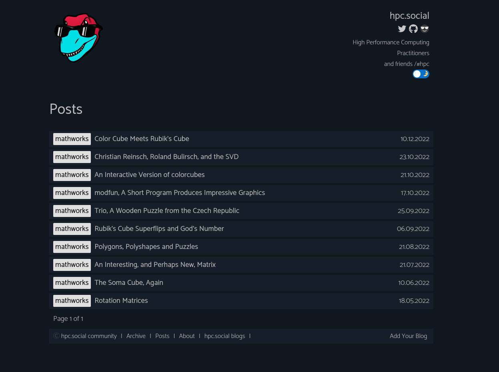

# hpc.social Commercial Syndicated Blog



This is the repository for the [syndicated blog](https://hpc.social/projects/blog/) for the hpc.social community!
Note that we have three flavors of blogs - an aggregated [personal blog](https://hpc.social/personal-blog/) along with a collection
of community blogs served from  [syndicated community blog](https://hpc.social/community-blog/), and the blog
here for commercial entities. The criteria for adding content feeds here is the following:

> The commercial blog space is for vendor and company voices that don't fit in the personal or community spaces. We advocate for learning resources, tutorials, and related content, and encourage contributors to not use this as an advertising space.

You can see the background for this discussion in [this thread](https://github.com/hpc-social/blog/pull/13).
Contribution steps are the equivalent across our community blogs, and you can
read about them [here](https://github.com/hpc-social/blog).

## Development

Note that we develop with a [shared theme](https://github.com/hpc-social/hpc-social-blog-theme)
you can generally update here via:

```bash
$ bundle install
$ bundle update
``` 

And any changes to the theme should bed one there (and thus consistent across the sites).
